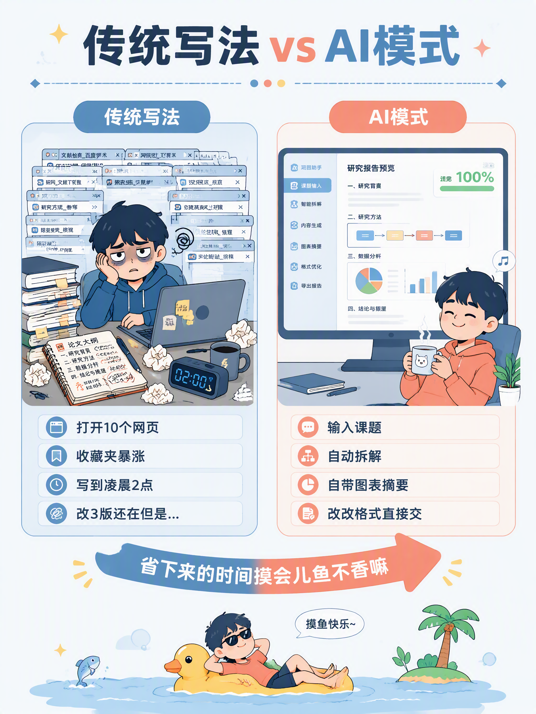
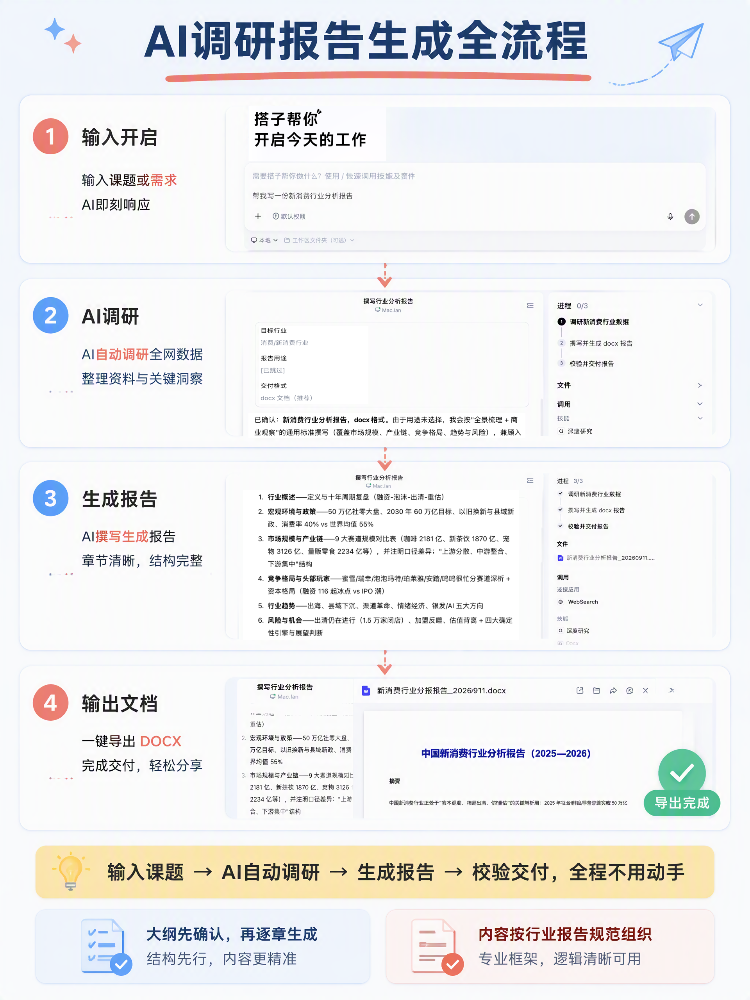

# 救命🆘 写报告真的会破防

救命🆘 真的破防了

上次老板在群里@我："下周一交一份行业报告 辛苦了"

我当时人都傻了

距离周一还有不到48小时，熟悉的配方又来了

打开十个网页 收藏夹唰唰涨，百度 知乎 36氪 艾瑞 各种研报，看得我眼花 脑子发糊

第一版交上去 老板："数据再核实下 结构再清晰点"

第二版："开头引言换个角度 再精炼下"

第三版："整体OK 但是\.\.\."（但是后面永远还有但是 我悟了）

写到凌晨两点，工位趴着睡着了

第二天顶着黑眼圈继续肝，一整个emo住了

后来被同事按头安利了DuMate，我当时：就这？能行？

用完：真香警告⚠️

课题输进去，它自己拆问题 自己扒资料 自己出图表，还带摘要带章节，我改改格式就能交，省下来的时间摸会儿鱼不香嘛嘿嘿。
\#AI工具 \#效率工具 \#调研报告 \#职场干货 \#打工人必备\#百度搭子 \#真干活用搭子

