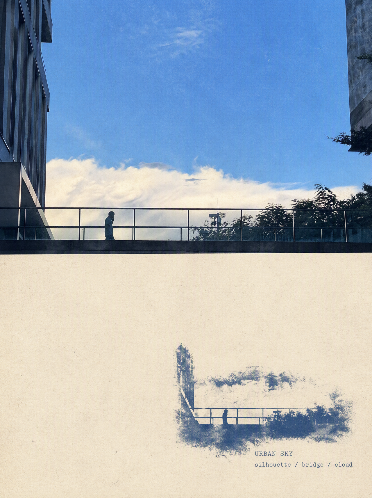
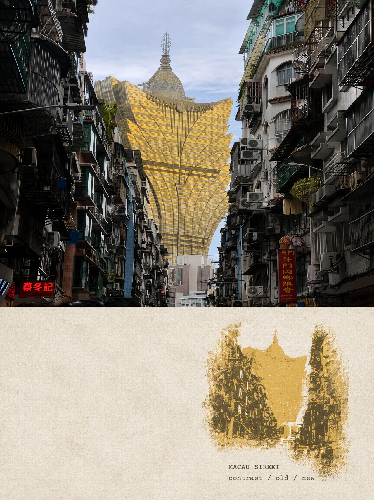
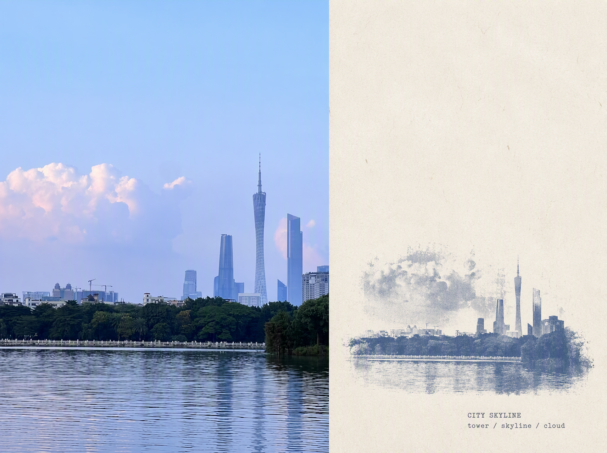
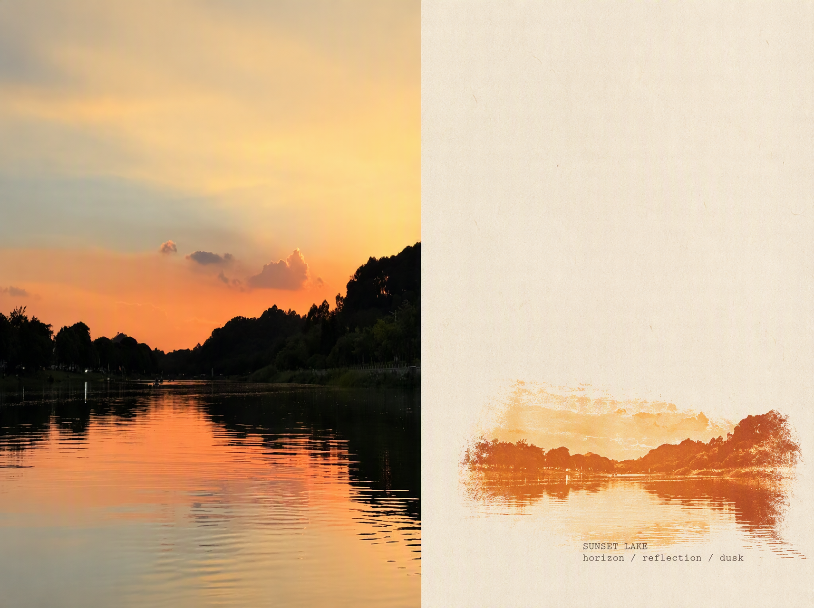
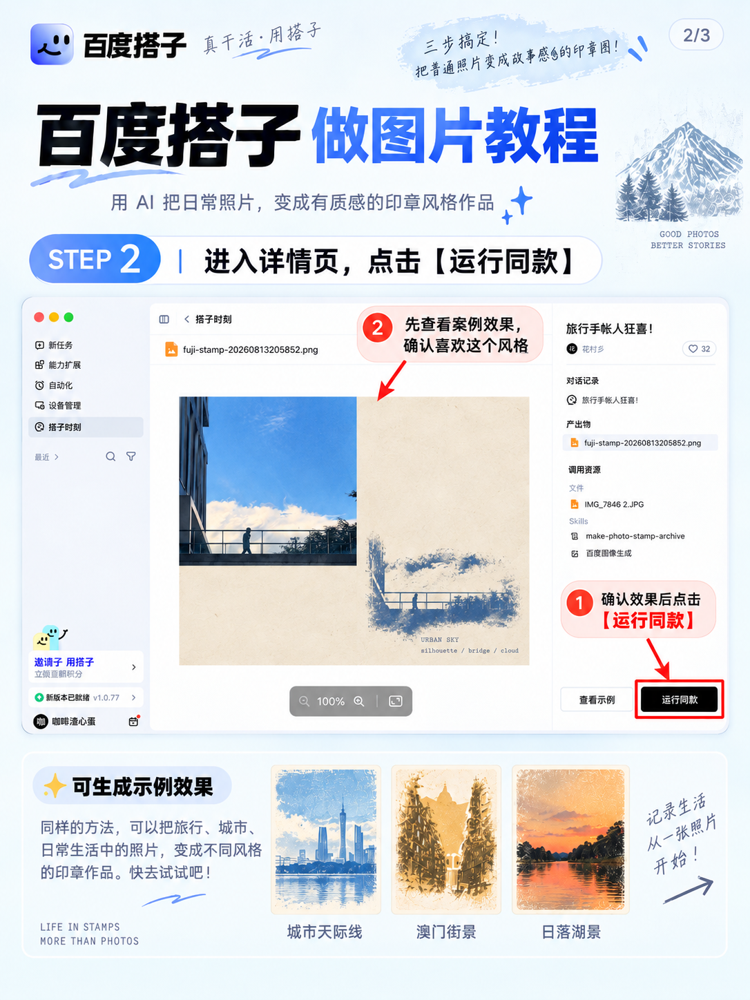
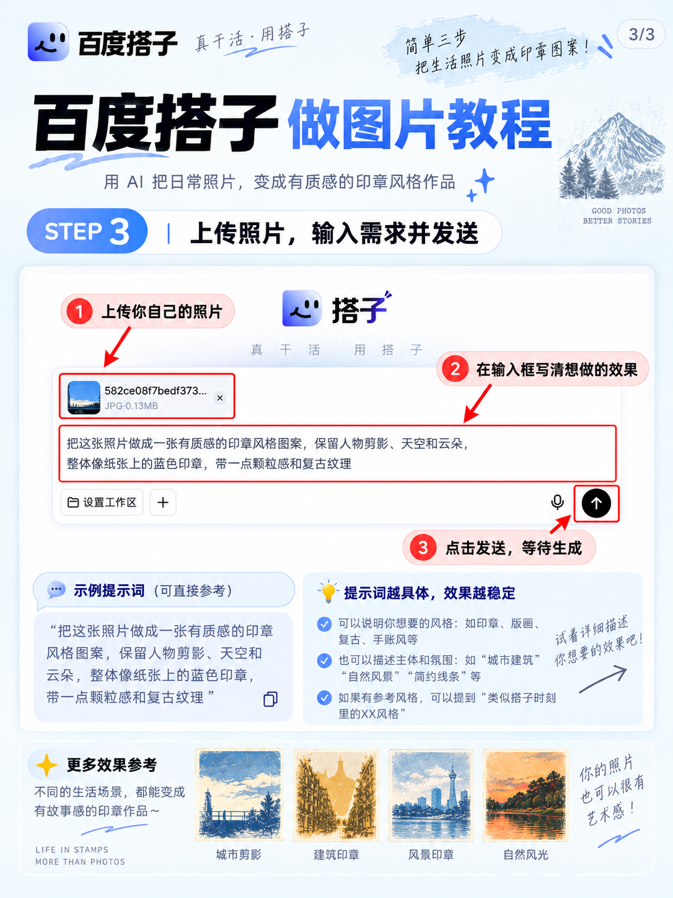

# 📷朋友圈这样发也太高级了吧！（附教程版）

最近发现一个特别适合发朋友圈的照片玩法。

以前拍完旅行照、天空、街景，基本就是原图直接发，拍的时候挺好看，发出来总觉得差点意思。
结果最近在百度搭子发现了新大陆，把普通照片做成这种复古印章 / 手帐拼贴风，瞬间感觉照片有故事了。

而且操作真的不复杂👇
先去「搭子时刻」里找到自己喜欢的图片玩法，点进去看效果，觉得合适就直接点运行同款。
上传自己的照片，再告诉它想要什么感觉，等一会儿就能出图。

我比较喜欢这种：

蓝天街景做成蓝色印章、城市建筑做成复古版画、晚霞湖面做成暖橘色印章……

重点是原本很普通的随手拍，也能一下变得很像旅行手帐。

现在感觉朋友圈根本不用每次都发精修大片。

一张生活照＋一张这种印章风小图，放在一起就很有氛围。

尤其适合：

旅行随拍 / 城市街景 / 天空晚霞 / 咖啡店 / 建筑 / 日常记录

最近准备把相册里的废片都翻出来重新玩一遍了😂
真的有种——照片没白拍，生活突然被重新整理了一次的感觉。

\#百度搭子 \#朋友圈高级感 \#朋友圈排版 \#照片玩法 \#旅行手帐 \#氛围感照片 \#日常记录 \#小红书教程 \#像素蛋糕 \#插画风

