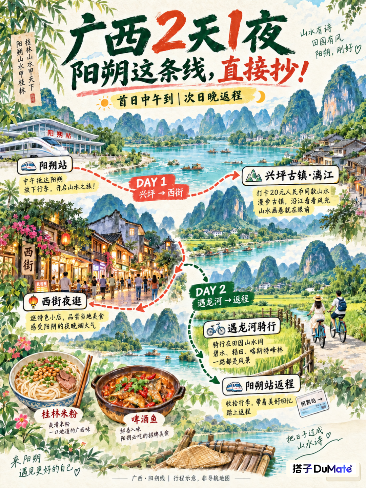
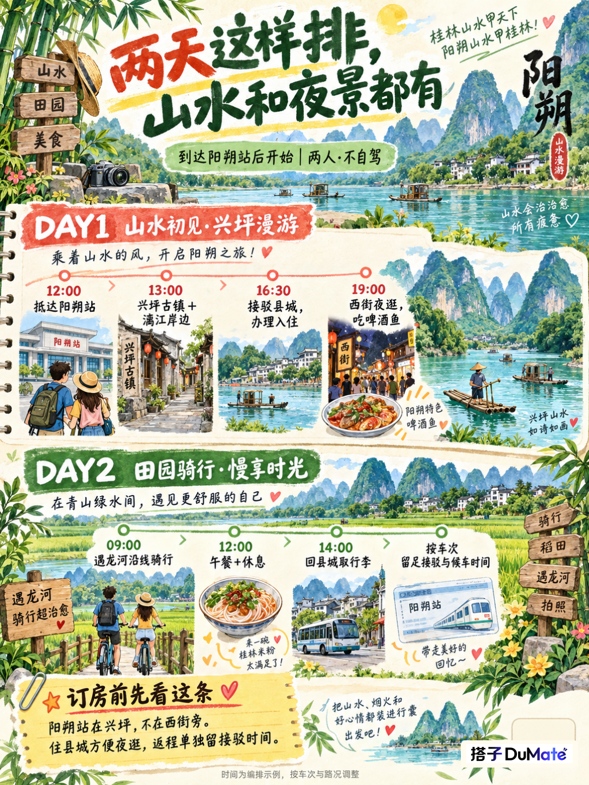
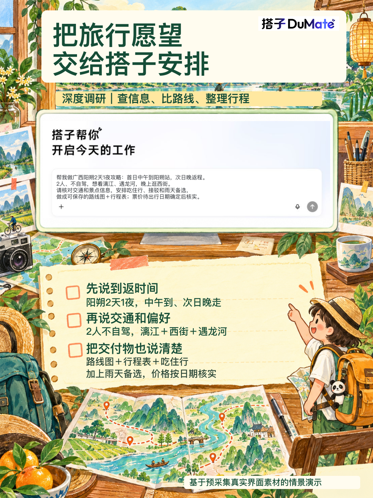
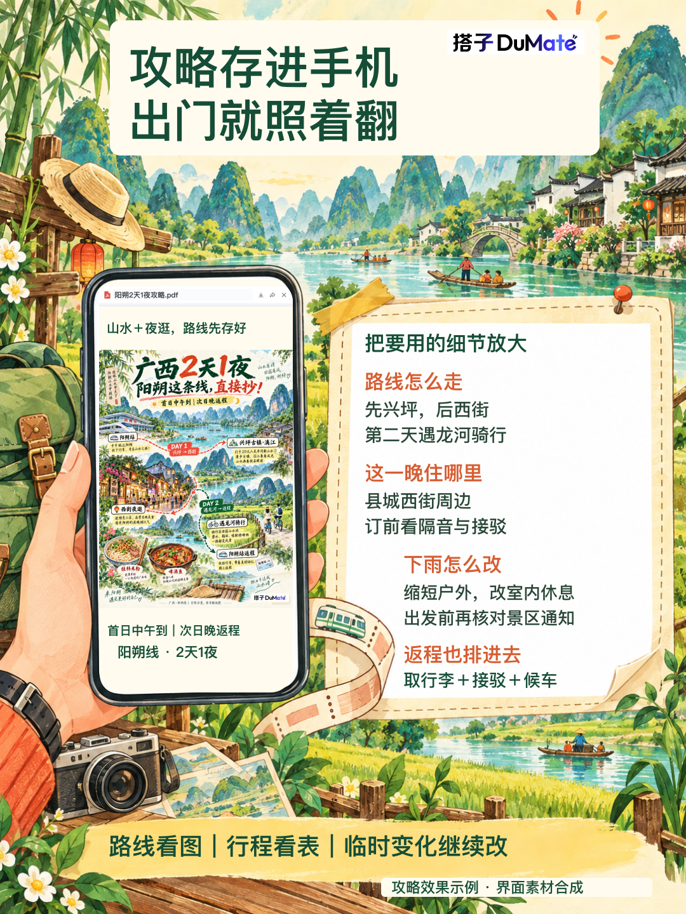

# 广西2天1夜，阳朔这条线直接抄！

周末想去广西看山水，又不想把两天都花在赶路上？🌿

先把目的地缩到阳朔：白天看漓江、骑车钻进田园，晚上留给西街和啤酒鱼。

这份按「首日中午到阳朔站、次日晚返程」安排，适合2人、不自驾。

到返时间相近，可以先收藏图1的路线＋图2的行程。

🌤 第一天：兴坪看山水，西街看夜色

阳朔站 → 兴坪古镇、漓江岸边 → 接驳阳朔县城、办理入住 → 西街夜逛。

下午把时间留给古镇和江边，晚上再慢慢吃饭逛街。

🚲 第二天：遇龙河骑行，给返程留余量

早上去遇龙河沿线骑行，中午吃饭休息，下午回县城取行李，再按车次安排去阳朔站的接驳。

行李寄存也要提前确认，别拖着箱子逛古镇。

📍订房前先记住：阳朔站在兴坪，不在西街旁！

想方便夜逛，可以看县城西街周边；订前留意隔音、接驳方式和时间。

做攻略最费脑子的，其实是把「到站、住哪、怎么玩、怎么回去」接起来。

这就很适合把需求交给百度搭子的【深度调研】：检索交通和景点资料、交叉核对，再整理成符合自己时间和偏好的行程。想要图示版，还可以继续交代路线图和行程表的排版要求。

💬 给搭子派活，可以直接这样说：

> 帮我做广西阳朔2天1夜攻略：首日中午到阳朔站，次日晚返程。
> 
> 2人、不自驾，想看漓江、遇龙河，晚上逛西街。
> 
> 请核对交通和景点信息，安排吃住行、接驳和雨天备选，
> 
> 做成可保存的路线图＋行程表；票价待出行日期确定后核实。
> 
> 

准备出发时，再补上具体日期、车次、酒店预算，让搭子按这些条件继续调整。遇上下雨，就把骑行改成更短的户外停留＋室内休息，出发前重新确认景区公告。

攻略值得存进手机的部分，就是这些能直接用上的细节：路线顺序、每天安排、住哪一片、返程怎么接。图3看派活方式，图4看成果展示。🍃

\#百度搭子 \#广西旅游 \#阳朔旅游 \#两天一夜 \#周末去哪玩 \#旅游攻略

