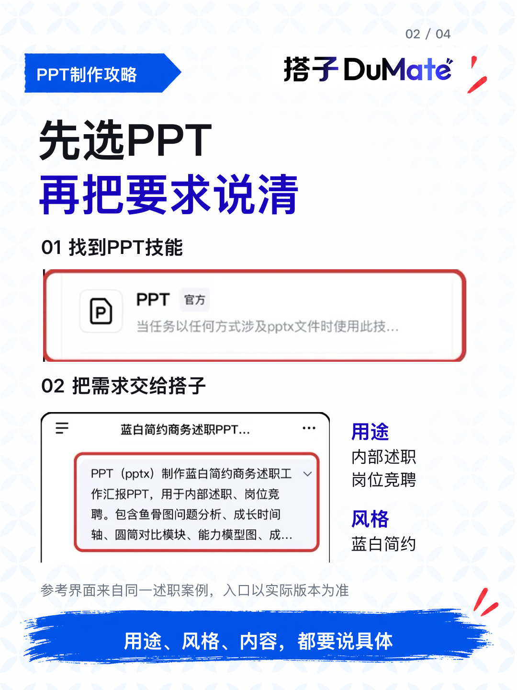
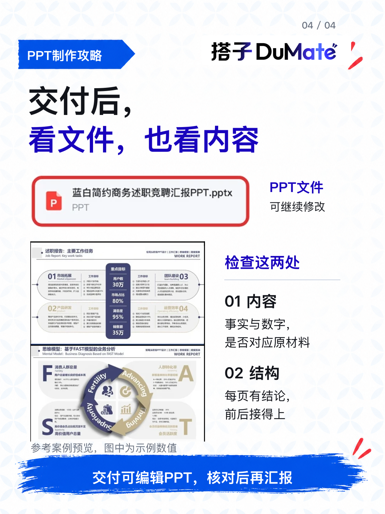

# 述职PPT还卡在第一页？

周报、项目记录写了一堆，整理述职PPT时，还是容易卡在这几个问题：先讲什么、讲多少、怎么排？😵‍💫

这里可以用上百度搭子的「PPT 制作」：把资料、汇报对象和风格要求交代清楚，让它梳理内容结构、配文配图、排版，最后交付可编辑PPT。

这篇把一组述职参考案例的操作界面拆开，看看需求怎么一步步变成文件👇

📌 先把用途说具体

参考界面里能看到PPT技能和任务输入。内部述职还是岗位竞聘，想用什么风格，需要哪些内容，都可以一起交代。

自己的工作记录、复盘材料和汇报模板，也要围绕同一任务准备好。

📌 篇幅确认，值得认真选

收到确认问题时，结合汇报时长、模块数量和展示重点再决定。图里的页数属于这条参考案例，不需要照搬成自己的固定标准。

📌 拿到文件，再看内容

这组界面展示了\.pptx文件卡和对应页面预览。用搭子的价值，是把需求推进到一份能继续修改的PPT；接着核对事实和数字，看看每页有没有结论、前后能不能接上。

派活时可以加一句：

“先确认大纲与篇幅，内容保留材料依据；缺失信息标待补充，最终交付可编辑PPT。”

配图中的操作与结果来自同一条参考案例，入口以实际版本为准，预览中的数字为示例数据。

\#百度搭子 \#PPT制作 \#述职报告 \#工作汇报 \#职场效率 \#AI办公

