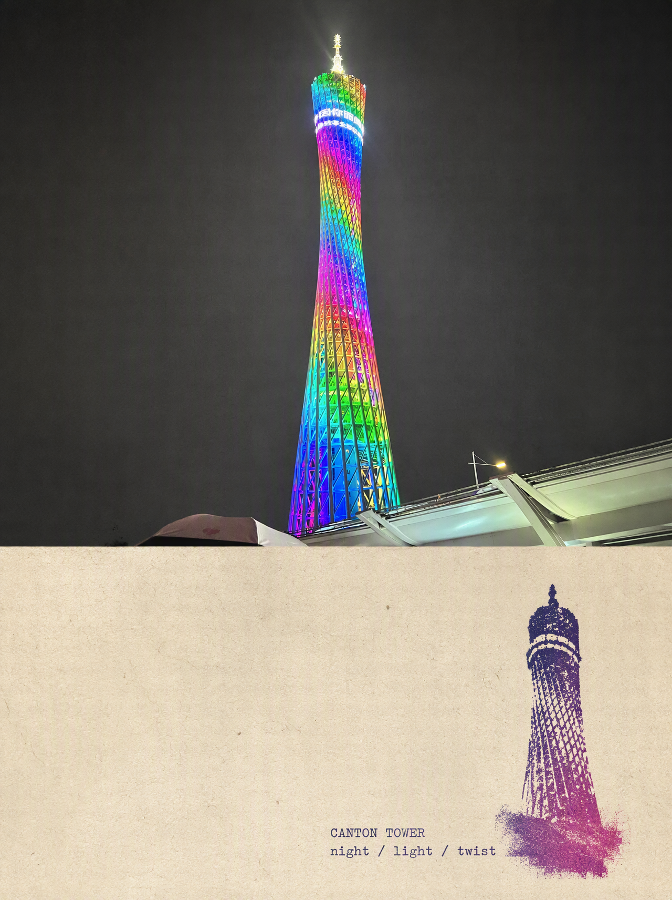
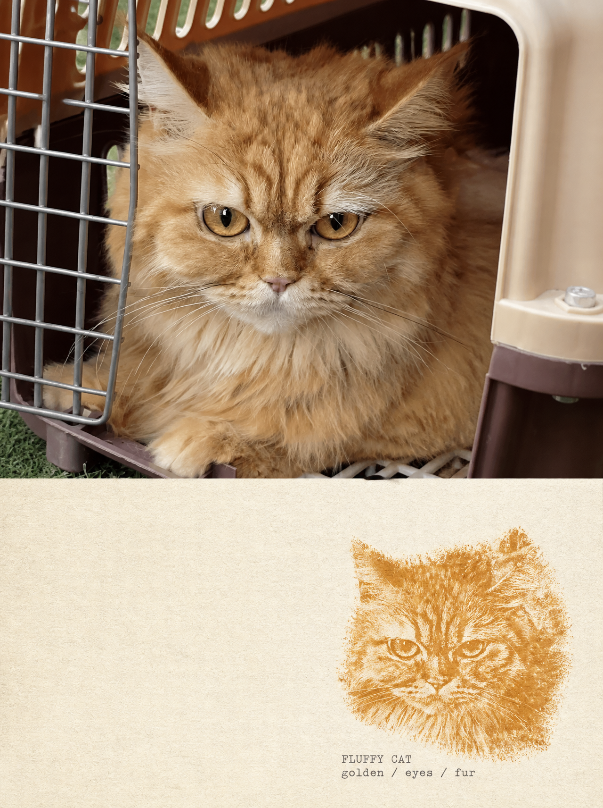
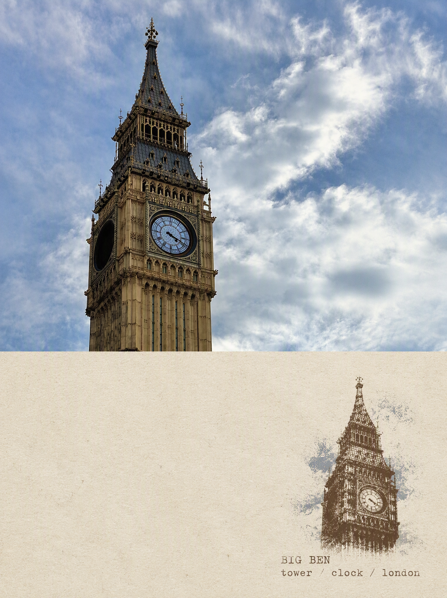
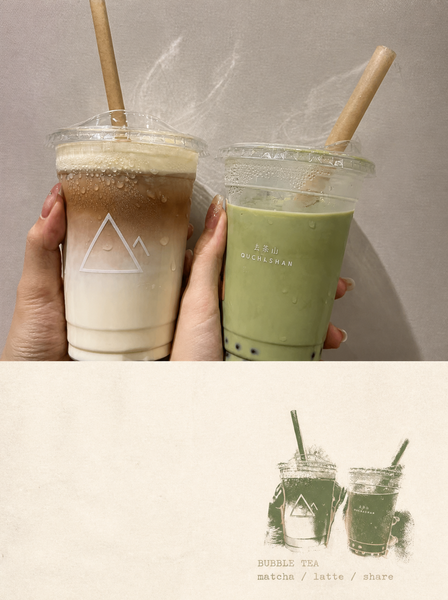
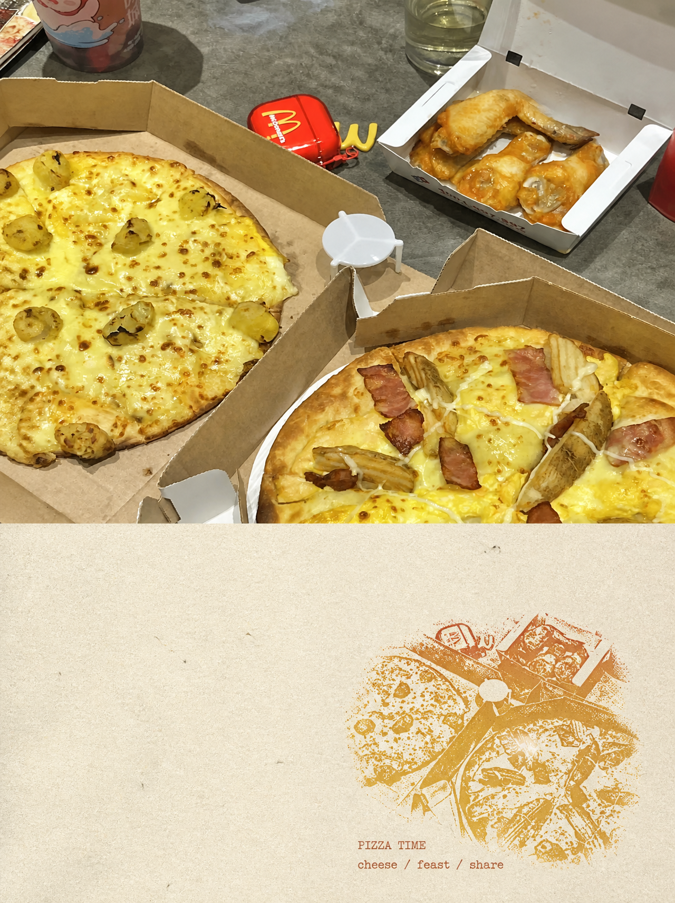
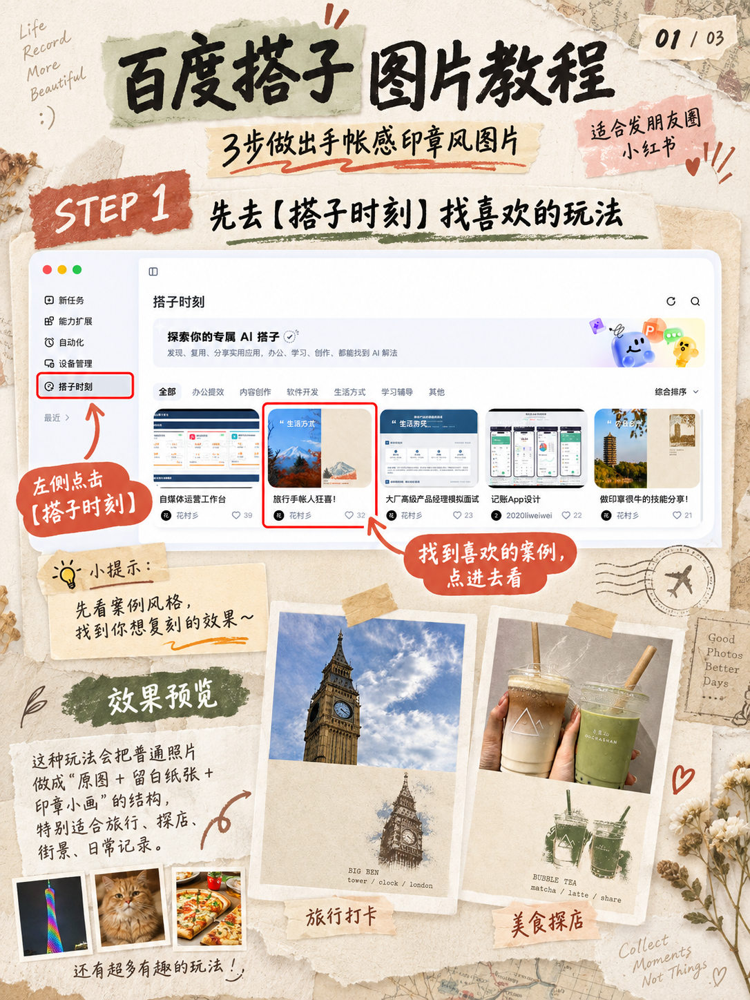
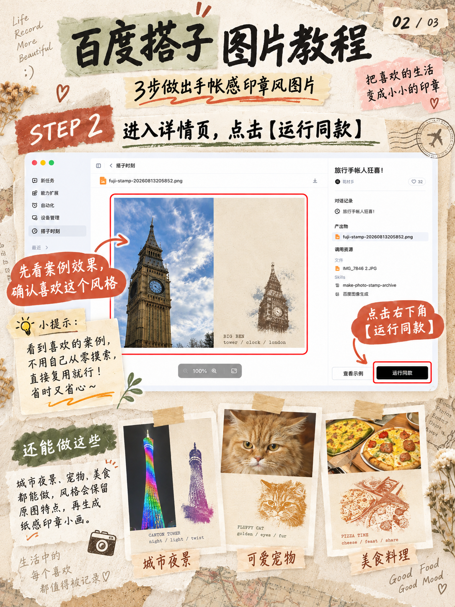
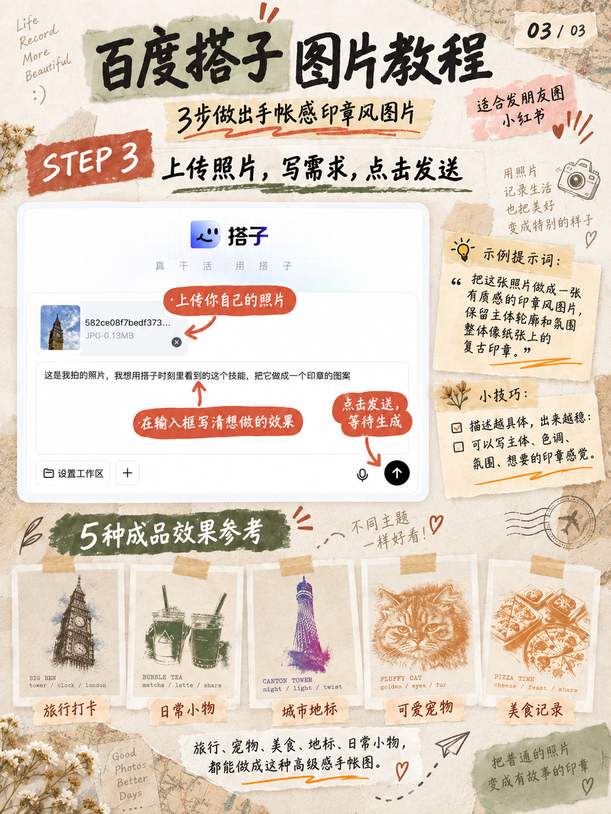

# 普通照片这样一排，突然像旅行杂志了

最近刷到很多**极简结构拼贴、照片手帐**的图，我最大的感受就是：
 照片本身不一定要拍得多专业，**排版对了，普通随手拍也能很有味道。**

于是我把相册里那些一直舍不得删、但单独发朋友圈又感觉“差点意思”的照片，全翻出来重新玩了一遍。

这次用的是百度搭子「搭子时刻」里的图片玩法。

我最喜欢它的一点，是不会把原照片完全改掉。
 而是保留一部分原图，再把照片里的主体提取出来，做成一张有颗粒感的**复古印章小画**，旁边留一大块纸张留白。

成品看起来特别像旅行手帐。

我拿几张完全不同的照片试了下：

大本钟 → 像旅行纪念章

奶茶 → 瞬间变成咖啡店手帐

广州塔夜景 → 有点城市限定印章的感觉

我家猫 → 莫名很像宠物档案卡哈哈哈

连披萨都能做成复古美食记录🍕

最重要的是操作没有我一开始想得那么复杂。

在「搭子时刻」里先找喜欢的案例，点进去看看效果，觉得这个风格可以，直接点「运行同款」。

然后上传自己的照片，告诉它：

“帮我把这张照片做成有纸张质感的印章风图片，保留主体和原本氛围。”

发出去等生成就行。

我后来发现，提示词也不用写得特别“专业”。
你就把自己脑子里想要的感觉说清楚，比如**复古一点、颗粒感、保留主体、做成蓝色/棕色印章**，反而更好用。

以前我发朋友圈特别纠结：

这张单独发是不是太普通了？

这几张放一起是不是又有点乱？

现在直接变成：

**原照片负责记录，印章小画负责氛围。**

尤其是旅行、探店、城市夜景、宠物、美食这种照片，真的很适合。

最近很火的那种**极简结构拼贴**之所以好看，我感觉也是因为它没有把照片塞得特别满。
有原图、有留白、有一个小小的视觉重点，看起来反而更高级。

所以我现在已经开始疯狂翻旧相册了……

那些以前觉得“不够好看所以没发”的照片，

换一种方式再看，居然都挺有故事感的。

\#百度搭子 \#搭子时刻 \#朋友圈排版 \#极简结构拼贴 \#照片手帐 \#旅行手帐 \#朋友圈高级感 \#AI图片 \#照片玩法 \#日常记录

