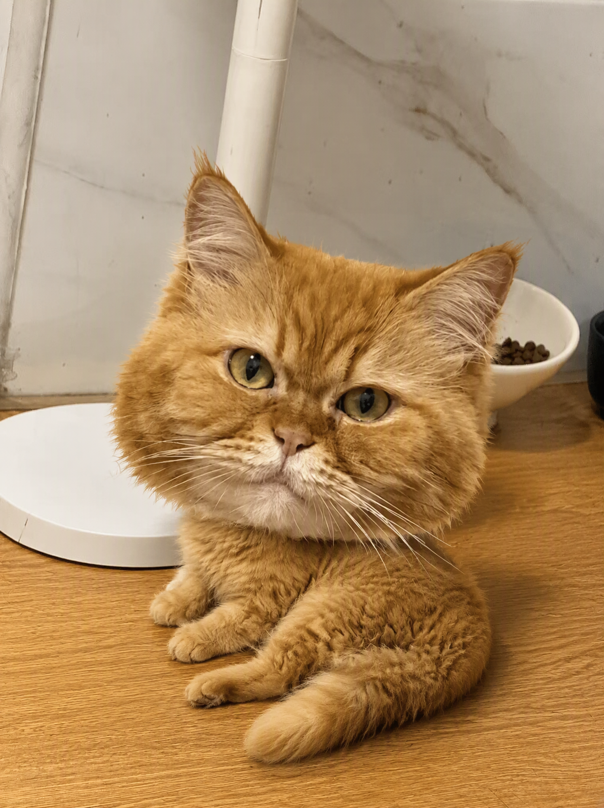
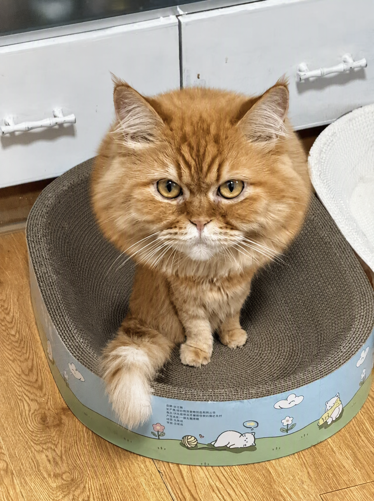
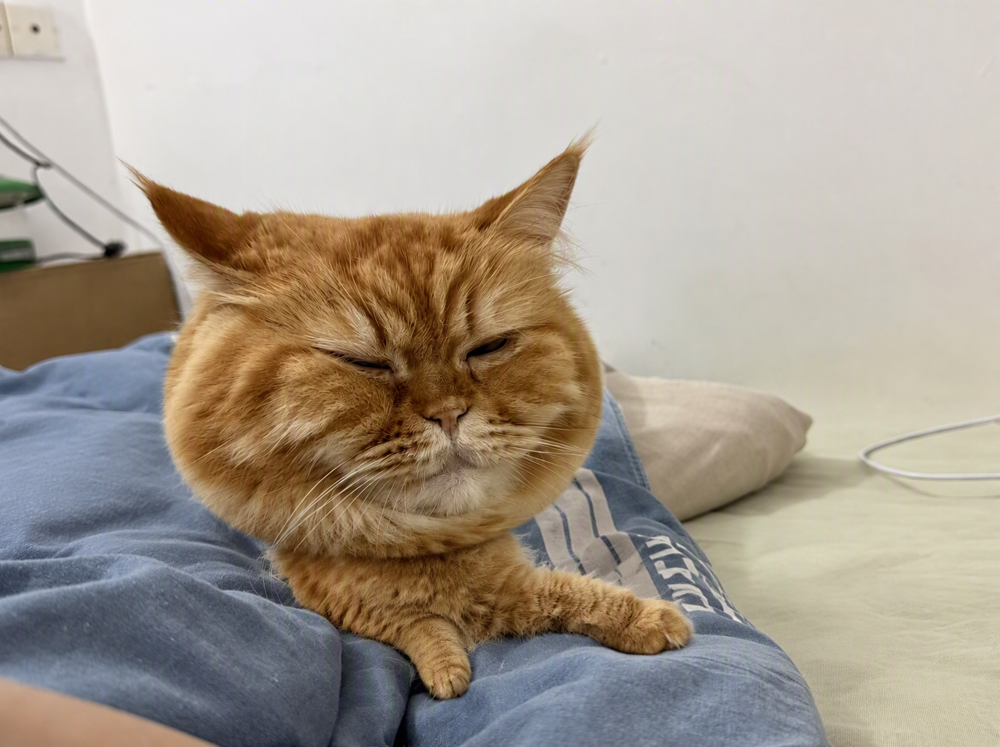
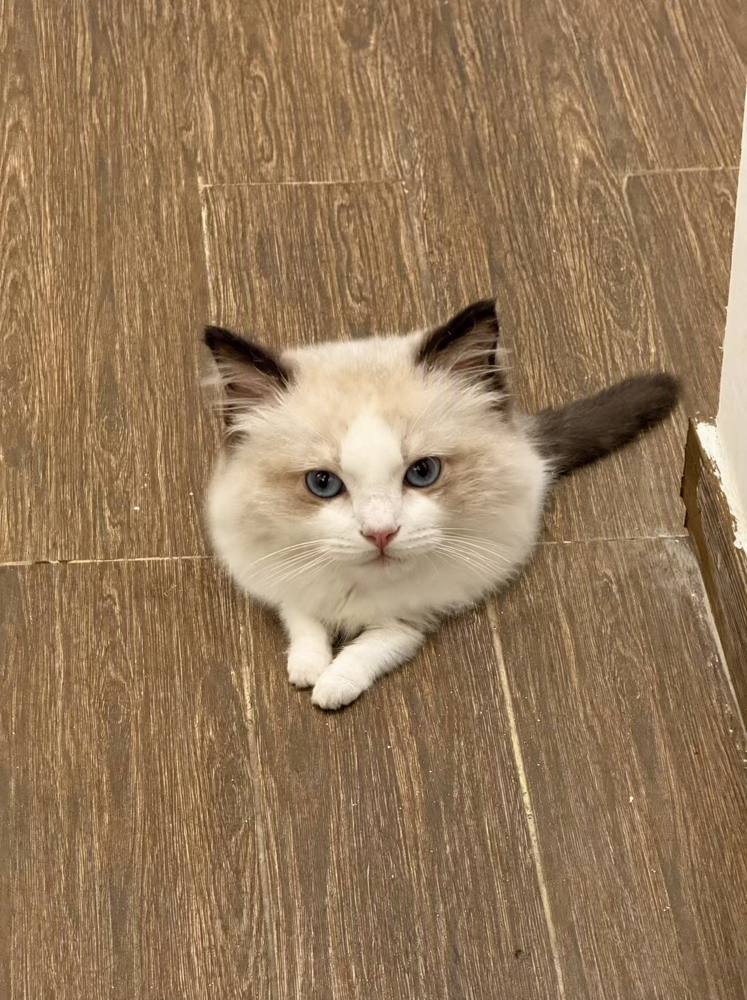
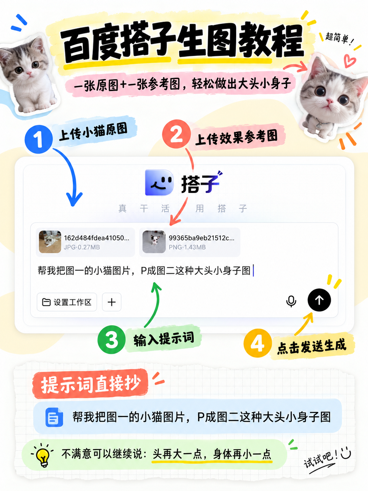

# 最近很火的“大头猫猫”我也是学会了

最近刷到很多大头小身子的猫猫图，没想到自己用百度搭子也能做出来（笑）

操作很简单：

先上传一张猫咪原图，再输入：

**“帮我把图1的小猫照片，P成图2这种大头小身子图。”**

等一会儿就可以了。原图里的毛色、表情和姿势基本都保留住了，只是把头部放大、身体缩小，莫名有种猫猫变成Q版手办的感觉。

我试了几张不同姿势，坐着、趴着、歪头的效果都挺有意思。家里有猫的真的可以玩一下，感觉每只猫都能做成自己的专属表情包～

\#百度搭子 \#AI修图 \#猫咪头像 \#猫奴日常 \#有趣的AI玩法

