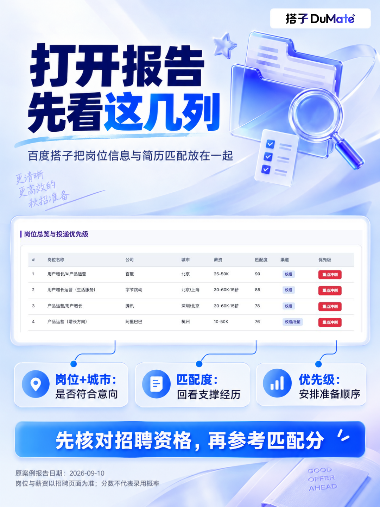

# 秋招别再对着JD猜自己配不配

岗位越存越多，投递列表越看越乱。点开每个JD，都觉得“好像能试，又好像差一点”🥲

这时候，可以把“先帮我筛一轮”这件事交给百度搭子的「简历岗位雷达AI助手工作流」。上传简历PDF，写清想找的方向，用搭子的联网调研和匹配分析，把散落的招聘信息整理成一份HTML报告。

图里的用户增长求职案例，整理了12个目标岗位。岗位、城市、薪资、匹配度和投递优先级放在一起，翻报告时就能连续看几个问题：

方向和城市符合我的意向吗？

哪段实习能对应岗位要求？

哪些地方还需要补证据、补能力？

秋招使用时，记得把自己的毕业届别、可工作城市、实习或正式岗这些条件一起说明。拿到报告后先核对招聘资格，再看匹配理由，最后安排准备顺序。

给搭子的指令👇

这是我的个人简历，我想找用户增长相关的岗位。请联网寻找招聘信息，分析岗位匹配度、薪资、地点、能力和投递优先级，并附岗位来源链接，生成可下载查看的HTML报告。请根据我的毕业届别和经验筛选；招聘状态、薪资或资格无法确认的，单独标为待核对。不要编造岗位和简历经历。

把“今天先准备哪家”变成一个有依据的选择，求职清单就更好用了。

\#百度搭子 \#秋招 \#应届生求职 \#简历 \#岗位匹配 \#AI工具

