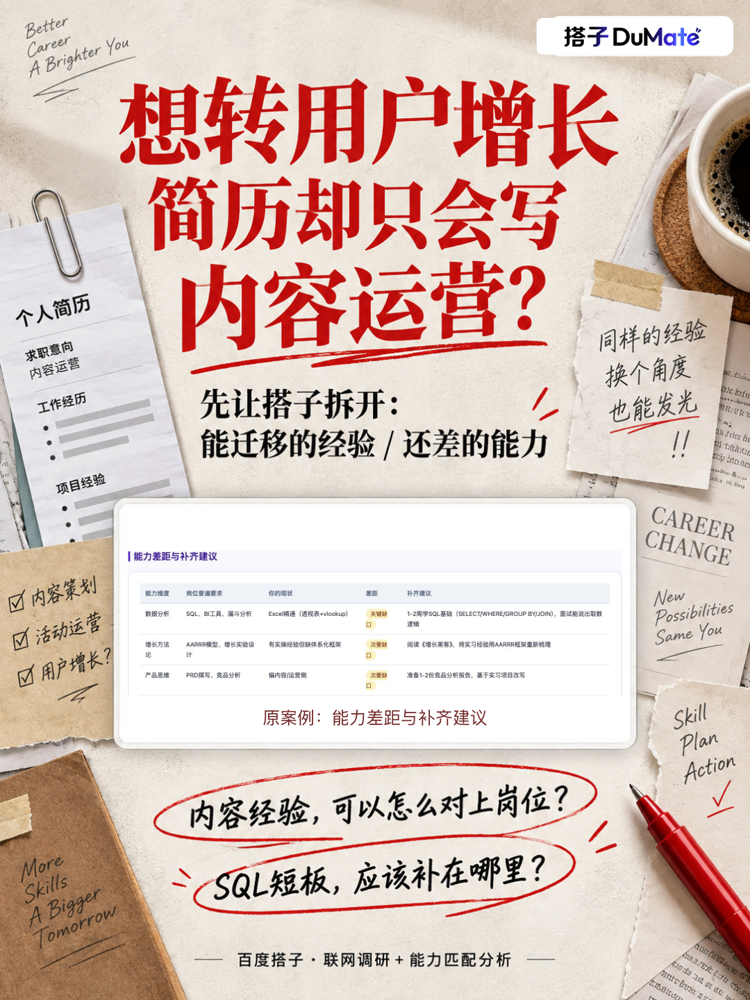
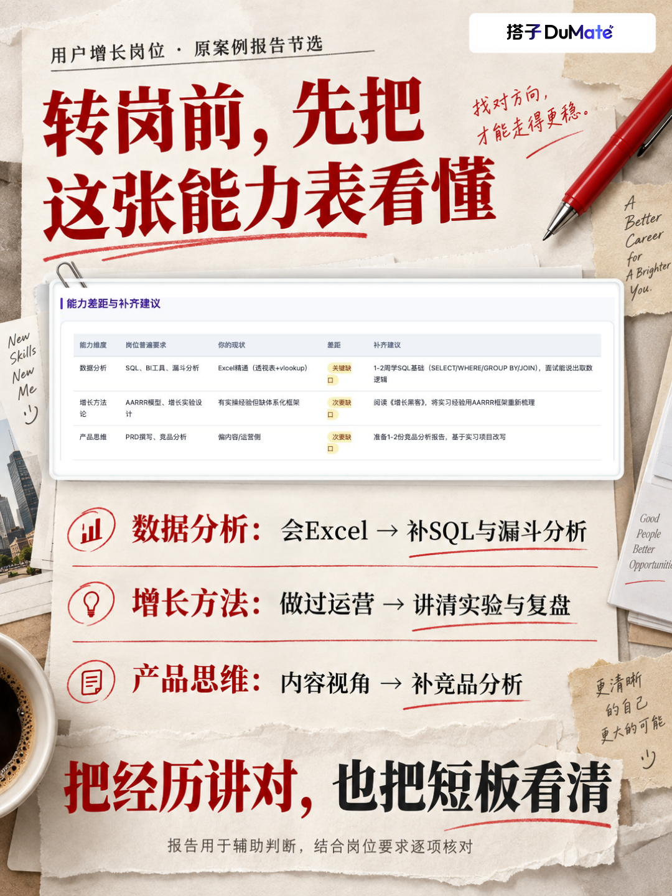

# 想转用户增长，先别急着重写简历

做过内容、写过脚本、跟过账号运营，想往用户增长方向走。一到改简历，又把经历写成了“负责发布内容、完成日常运营”……

先把经历和目标岗位放在一起看，会更容易找到该写什么。

百度搭子的「简历岗位雷达AI助手工作流」就适合做这一步：读取简历，联网找相关岗位，分析匹配点和能力差距，再交付一份可以打开看的HTML报告。

图里这份案例的“能力差距与补齐建议”尤其值得看：

📌 数据分析：已有Excel经验，但目标要求还涉及SQL、BI和漏斗分析。

📌 增长方法：做过运营，需要把实验、指标和复盘讲成完整过程。

📌 产品思维：从内容执行往前走，还需要补充竞品分析和产品视角。

这张表的用途很具体：一边找能迁移的经验，一边决定该补什么。回到简历时，再用自己的真实项目证明这些能力。

可以这样给搭子派活👇

这是我的简历，我有内容运营相关经历，想找用户增长方向的岗位。请联网寻找相关招聘信息，结合简历分析匹配度、薪资、地点、能力差距和投递优先级，附来源链接并生成HTML报告。请把可迁移经验与能力缺口分开写，每条判断对应具体经历或岗位要求；不要把没有做过的工作写成我的经验。

先看懂岗位要什么，再决定简历怎么讲，准备作品或面试时也能更有方向。

\#百度搭子 \#转岗 \#内容运营 \#用户增长 \#简历优化思路 \#职场成长

