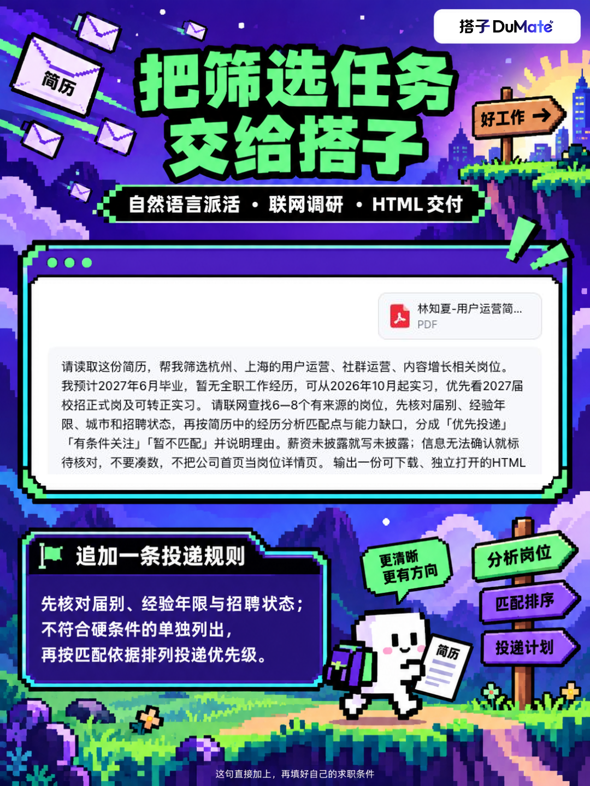

# 海投不是抽卡，先把岗位排个队

求职人的常见操作：看到一个岗位，先收藏；看到一家大厂，再收藏。收藏夹越来越满，今天到底先投哪个，还是没想好🫠

可以用百度搭子的「简历岗位雷达AI助手工作流」做一份投递前的岗位分析报告。

给它简历和目标方向，让搭子联网调研岗位，把匹配度、薪资、城市、能力要求和投递优先级整理成HTML，保留来源链接。回看岗位时，信息就在同一张表里。

但这份报告要这样用：

先核对届别、经验年限、招聘状态，再看匹配分和理由。硬条件不符合的岗位，先单独放到待核对列表；确实对口的，再投入时间研究JD、准备经历和作品。

尤其别把匹配分当成录用概率。“为什么匹配”和“哪里不符合”，比一个分数更值得看。

这句筛选要求可以直接补上👇

这是我的简历，我想找用户增长相关岗位。请联网检索岗位，分析匹配度、薪资、地点、能力要求和投递优先级，附来源链接，输出HTML报告。先核对毕业届别、经验年限与招聘状态；不符合硬条件或信息不完整的岗位单独列出。对符合条件的岗位，说明匹配依据、待补能力和排序理由。不要仅按公司名气或薪资排序。

让投递清单有顺序，今晚的准备时间才知道该花在哪里。

\#百度搭子 \#求职 \#海投 \#投递策略 \#岗位分析 \#AI效率工具

