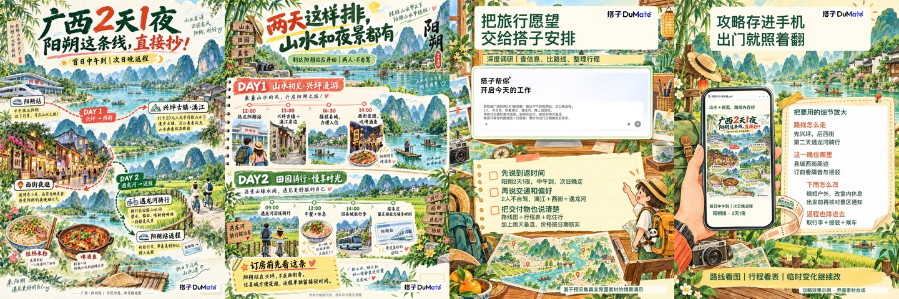

# 完整案例：广西·阳朔两天一夜

2026-09-13成稿后，用户要求将此次流程和要求固化为完整Skill。此例记录制作方法，不代表有投放效果数据，也不是以后每篇固定套用的版式。

## 需求怎样变成可用成果

用户将“一天两夜”更正为“两天一夜”，没有提供出发城市或具体日期。因此缩小为广西阳朔一线，以“首日中午到阳朔站、次日晚返程；2人、不自驾”为明确示例条件，避免假装两天游遍广西。

主功能选“深度调研”：检索、交叉核对交通与景点信息，再按时间和偏好整理。自然语言派活是交代任务的方法；图示排版属于辅助视觉产出。正文与功能页都点明功能，不能只在封面贴搭子Logo。

派活提示词：

> 帮我做广西阳朔2天1夜攻略：首日中午到阳朔站，次日晚返程。
> 2人、不自驾，想看漓江、遇龙河，晚上逛西街。
> 请核对交通和景点信息，安排吃住行、接驳和雨天备选，
> 做成可保存的路线图＋行程表；票价待出行日期确定后核实。

## 参考选择与新内容

- A009：学习路线图先吸引收藏，再解释条件和细节。
- A043：学习水彩攻略、使用场景、成果放大的结合。
- B050：学习品牌、产品界面和图示产物如何衔接。

三篇正文及全部图片组实际查阅，关键图另看原尺寸。新路线、时间条件、文字和画面重新组织，不搬用样本的城市、票价、个人经历和制作速度。

## 四张图各自做什么

| 页 | 主要内容 | 作用 |
|---|---|---|
| 封面 | “广西2天1夜，阳朔这条线直接抄！”＋完整山水路线图 | 强钩子与可收藏成品同时出现；路线是顺序示意而非导航 |
| 行程 | 第一天兴坪→县城入住→西街；第二天遇龙河骑行→取行李→接驳返程 | 把两天一夜和不自驾落到实用安排，补阳朔站位置提醒 |
| 派活 | 旅行桌面中嵌入搭子输入组件＋完整指令＋条件批注 | 显示“深度调研：查信息、比路线、整理行程”，让读者能照着派活 |
| 成果 | 手机中打开同一张路线图，旁边放大住哪、雨天与返程安排 | 把提示词里的要求变成可见效果，避免只展示PDF文件卡 |

采用山水水彩旅行手账。同篇有识别度，地图、时间线、桌面派活和手持成果各有主体。不要把这次绿色水彩、四张数量或“直接抄”标题当作所有未来场景的必选项。

## 界面与精确文字怎样处理

预采集U001提供首页派活组件，U106提供文件预览栏；官方Logo单独等比合成。旅行指令、文件名与攻略属于本次情景内容，未现场运行搭子任务。

先用生图建立旅行场景、设备、道具和阅读关系，再嵌入真实产品组件与清晰中文。手机成果页复用封面同一文件，没有让模型重新生成另一份路线。长文字独立排版避免变形，装饰与文字相交后调整位置。这是历史做法记录。按用户后续修正，新稿不强制印“原案例/演示页”等制作标签；内部保留合成来源，公开表达不虚构亲测。

## 事实和交付

站点位置依据[广西新闻网的阳朔站介绍](https://gxxwfb.gxnews.com.cn/article.v2019.php?id=14329889)。只用稳定地点信息，没有采用旧票价、旧班次或承诺车程。具体日期、车次与酒店仍未指定，时间表标为编排示例。未来使用此例时重新核实所需不稳定信息。

交付4张1080×1440原图、发布文案、可复制派活提示词、预览、两页攻略PDF、制作说明及ZIP。PDF由本地成图组成，未称作搭子实测导出。完整成稿在原项目 `output/dazi-guangxi-2d1n-20260912/`；便携预览已随Skill保存，无需依赖该目录理解此例。
